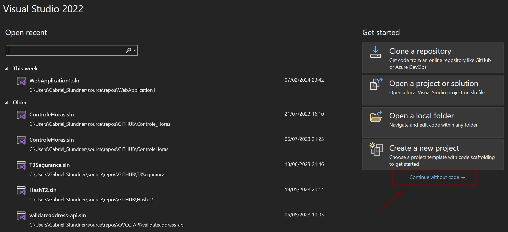
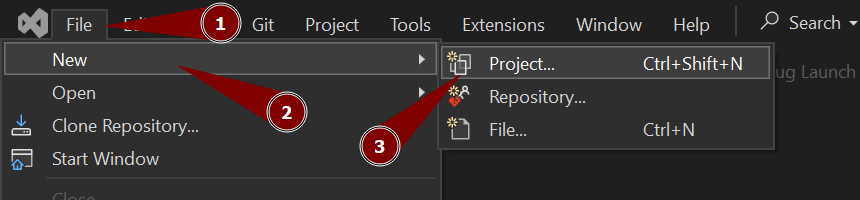
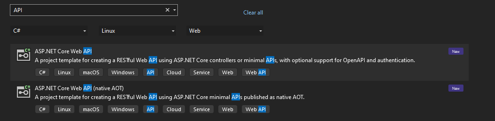
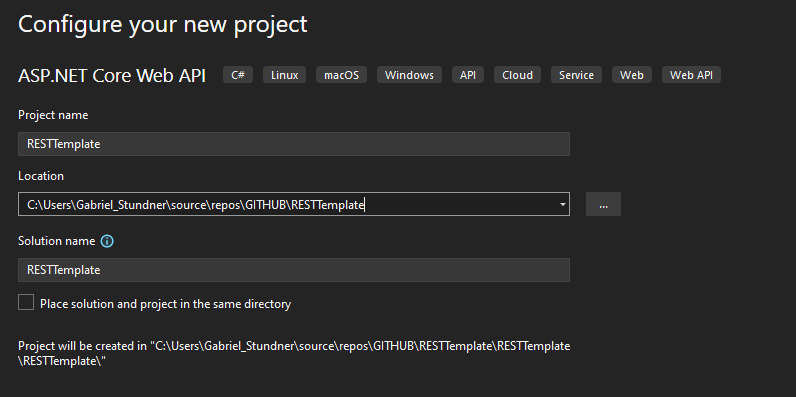
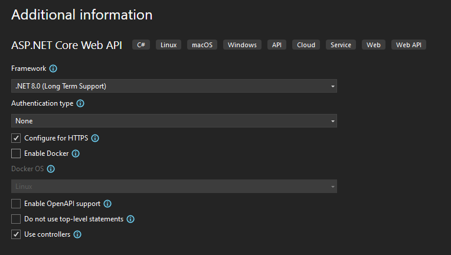
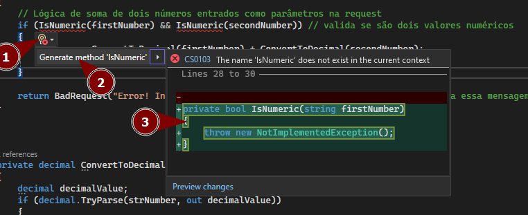

[Home](README.md)
## Criação de um projeto ASP.NET pelo Visual Studio

---

Para podermos construir o template do ASP.NET é preciso criar um projeto inicial pelo Visual Studio, isso nos faz agilizar as configurações iniciais do projeto para focarmos na construção da API REST. 

### Criando o projeto pelo Visual Studio

1. Abra o Visual Studio sem abrir código.

2. Vá em **File/New/Project...** ou **Ctrl + Shift + N**.

3. Pesquise por um template que possua o nome **API** e defina a linguagem para C#, Para sistemas Linux e que seja para Web.

4. Defina o nome do projeto e onde ele deve ser salvo no seu computador.

5. Defina  versão do .NET que o programa vai ser criado, defina para HTTPs e que usaremos controllers, como mostra a imagem abaixo:

6. Clique em criar e ele vai gerar o código inicial de um projeto ASP.NET no .NET em C# para web.

### Renomeando um projeto
---
Com o `F2` do teclado podemos renomear um arquivo que tivermos selecionado no Visual Studio

### Como gerar um método
---
Pelo Visual Studio podemos colocar o nome de uma função e ele pode nos gerar o esqueleto da função.

Como mostra abaixo, vai aparecer uma lupa e mostrar a opção de gerar o método vazio para implementarmos a lógica.

