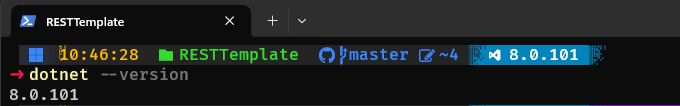

[Home](README.md)
## Guia de instalação e configuração do .NET 8
---
### Instalação

Vá no site oficial de Download do [.NET 8](https://dotnet.microsoft.com/en-us/download/dotnet/8.0) e selecione o seu sistema operacional.


Ele irá começar o Download da versão selecionada em seu computador, caso não funcione ele mostra opções de como instalar o programa.


Clicando no __.exe__ instalado ele vai começar as etapas de instalação, onde deve possuir permissão de administrador da máquina para fazer modificações no sistema.


Ele vai começar a instalação e após concluir mostrará opções de documentação para auxiliar os desenvolvedores no inicio de sua jornada .NET, mostrando a tela abaixo:


### Testando a instalação

Assim que concluir a instalação, tente rodar o seguinte comando:

```shell
dotnet --version
```

Deve aparecer a versão do .NET, caso não apareça de primeira, reinicie o computador.


