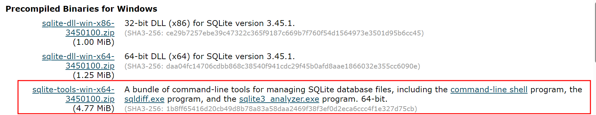
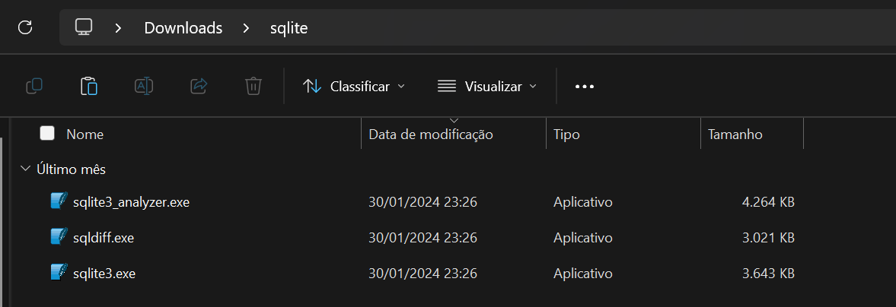
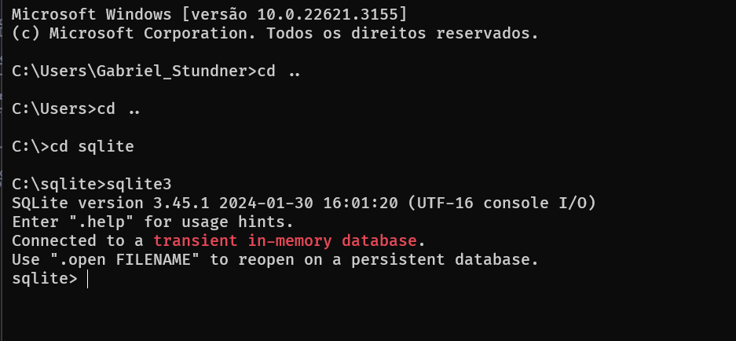
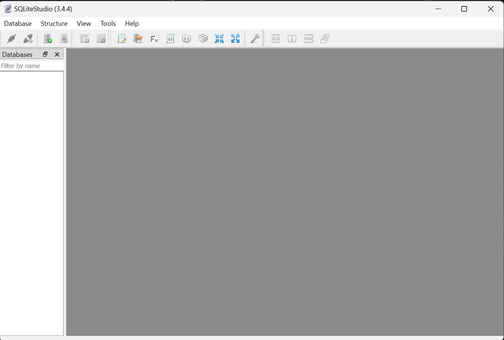

[Home](README.md)

## Instalação do SQLite e SQLite Studio
---
### O que é SQLite?

SQLite é uma biblioteca em linguagem C que implementa um banco de dados SQL embutido. Isso significa que programas que usam a biblioteca SQLite podem ter acesso a um banco de dados SQL sem a necessidade de executar um processo de Sistema de Gerenciamento de Banco de Dados (SGBD) separado.

Diferente de outros modelos de banco de dados, o SQLite não depende de um servidor para armazenar suas informações. Ele é capaz de criar uma estrutura com um banco de dados embutido, funcionando como um servidor próprio e independente. O Sistema de Gerenciamento de Banco de Dados, ou SGBD, pode ser executado na mesma instância, eliminando assim as consultas e processos separados.

O SQLite é um tipo de banco de dados relacional, ou seja, cria arquivos com base na relação entre diferentes elementos, geralmente assumindo a forma de uma tabela. Ele é de código aberto e gratuito, sendo muito utilizado em aplicações mobile, com foco no sistema Android.

Por ser mais prático e acessível, o SQLite é recomendado para aplicativos desktop ou mobile mais simples, sites mais leves e sem muitos recursos, e sites ou sistemas que ainda não têm muitos usuários. Ele suporta um grande número de linguagens, algo em torno de 30, o que faz toda a diferença para que seu uso tenha sido cada vez mais recorrente.

### Instalação do SQLite

O bom do SQLite é que ele não precisa instalar nada no computador, não precisa de permissões de administrador.

Podemos baixar o programa no site oficial: [SQLite Download Page](https://sqlite.org/download.html)

Escolha a versão para Windows mostrada abaixo, ela possui o Shell e command line infos para seu computador.

Baixe o .zip e coloque na sua pasta de Downloads, extraia os documentos e renomeie para __sqlite__ e é esperado que você tenha os seguintes documentos:

### Teste de Instalação

Agora que colocamos o sqlite folder no **C:/** devemos acessar esse diretório pelo seu console windows e rodar o comando **sqlite3** no console:

Se mostrar a versão do SQLite e acessar o banco significa que foi instalado com sucesso!

Para sair do SQLite do console coloque o comando **.quit** ou __.q__ ou __.exit__.

### Instalação do SQLite Studio

O SQLite Studio também não precisa de permissão de administrador para baixar, onde podemos usar a versão __portátil__ em qualquer computador.

Pode baixar a versão portátil pelas opções de __release__ do projeto como neste link: [Releases · pawelsalawa/sqlitestudio (github.com)](https://github.com/pawelsalawa/sqlitestudio/releases)

Não precisa instalar o programa, nesse caso você extrai todos os arquivos que se encontram no .zip e coloque no diretório que quiser, então somente clique no arquivo **SQLiteStudio.exe** para iniciar o programa, ele deve mostrar a imagem a seguir inicialmente:

