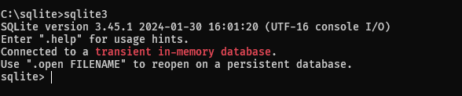
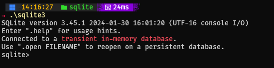
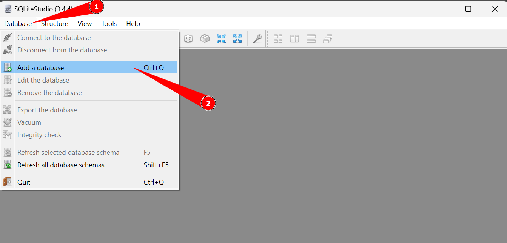
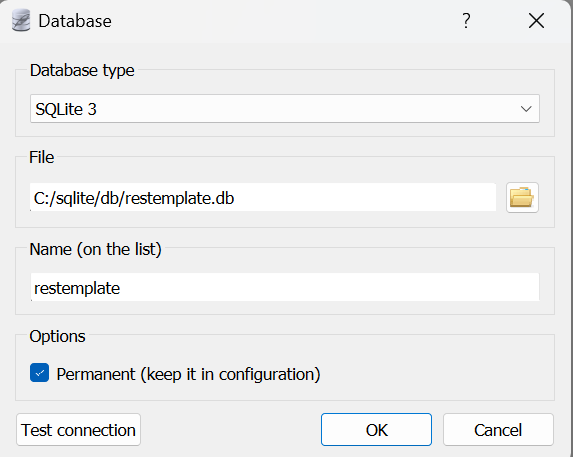
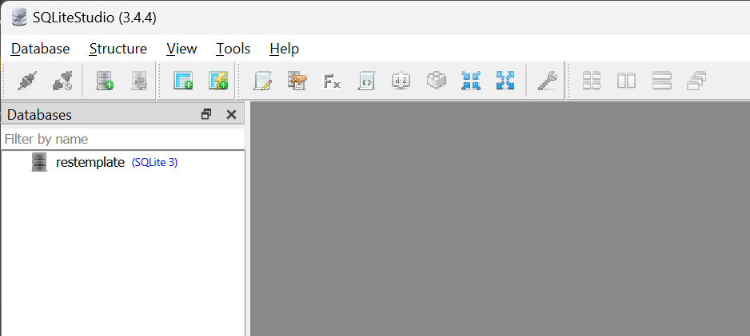
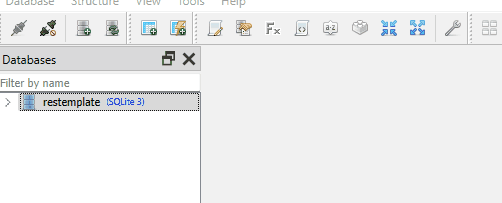
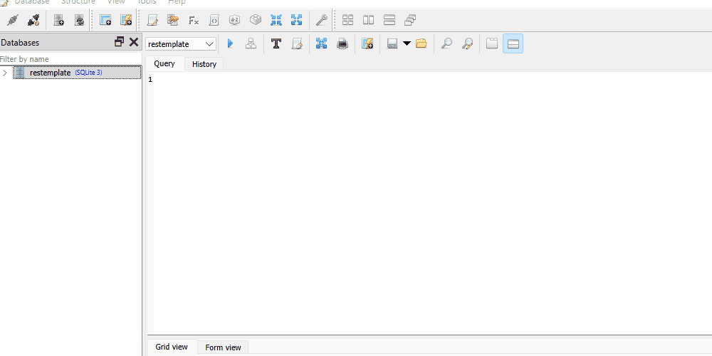
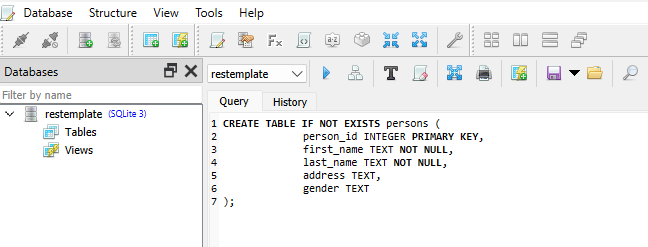
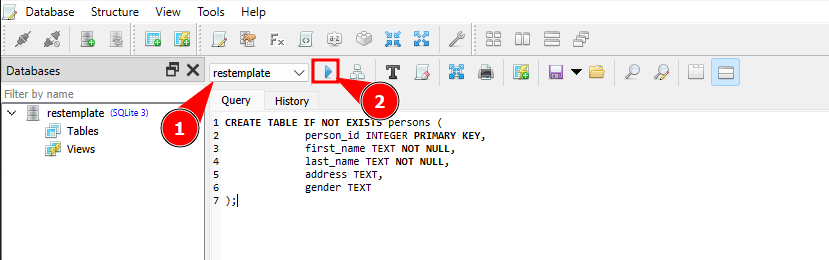
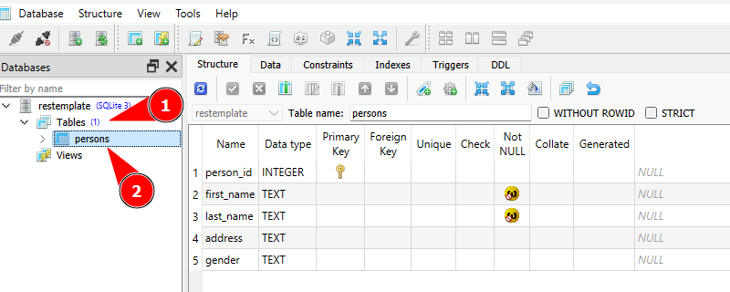

[Home](README.md)

## Exemplos de uso do SQLite
---
### Acessando o SQLite pelo PowerShell
Acessar pelo prompt de comando somente acessamos a rota `C://sqlite` e rodamos o comando __sqlite3__ diretamente:



Para acessar pelo Powershell é um pouco diferente, temos que colocar `.\` antes do comando:


### Comandos mais usados
Quando colocamos o comando **.help** no console conectados ao SQLite ele nos mostra os tipos de comandos que podemos usar:

| Comando | Descrição |
| ---- | ---- |
| `.databases` | Lista todos os bancos de dados. |
| `.tables` | Lista todas as tabelas no banco de dados atual. |
| `.schema` | Mostra o esquema de criação de todas as tabelas. |
| `.header on` | Ativa a exibição de nomes de colunas no resultado da consulta. |
| `.mode column` | Configura o formato de saída para o modo coluna. |
| `.exit` | Sai do SQLite. |
| `SELECT * FROM nome_tabela;` | Seleciona todos os dados de uma tabela. |
| `INSERT INTO nome_tabela (coluna1, coluna2) VALUES (valor1, valor2);` | Insere dados em uma tabela. |
| `UPDATE nome_tabela SET coluna1 = valor1 WHERE condição;` | Atualiza dados em uma tabela. |
| `DELETE FROM nome_tabela WHERE condição;` | Deleta dados de uma tabela. |
### Criação de um database
Para isso devemos criar uma pasta em nosso diretório **C:/sqlite** chamado **db** onde iremos colocar nossos databases. Esse é o caminho onde colocaremos e interagiremos com nosso banco de dados SQLite:

```
C://sqlite/db
```

Acessamos o diretório **C:/sqlite** por um console e rodamos o seguinte comando:

```
sqlite3 db/nomedatabase.db
```

Esse comando vai criar um banco de dados chamado `nomedatabase` dentro do diretório **db** totalmente vazio.
### Verificando qual database está conectado
---
Quando rodamos o comando __.database__ conectado ao `sqlite3` podemos ver a rota para o banco de dados conectado atualmente, já que ele não mostra o nome do database sempre que você se conecta nele.
```sql
sqlite> .database
sqlite> C:/sqlite/db/restemplate.db
```

### Desconectando de um database
---
Podemos nos desconectar de um database utilizando três comandos: __.exit__ ou __.quit__ ou __.q__ 
Esses comando farão o `sqlite3` finalizar e voltar ao console normal.

### Acessando no SQLite Studio
---
Com o nosso banco de dados criado, podemos acessar ele pelo GUI do SQLite Studio da seguinte forma:
1. Abra o SQLiteStudio e clique na opção **Database** no canto superior esquerdo e depois em **Add a database**


2. Ele vai abrir uma nova tela onde você deve selecionar o arquivo `.db` do banco de dados que criamos no console no passo anterior e escolher a opção de manter ele permanentemente aberto no SQLiteStudio.


3. Podemos testar a conexão com o nosso banco de dados clicando no botão **Test connection** para avaliar se ele consegue acessar.
4. Agora ele deve mostrar no canto esquerdo os databases disponíveis para acessar.



Pronto! com isso podemos interagir com o nosso banco de dados desejado.
### Criação de uma tabela

#### Constraints
---
SQLite constraints serve para especificar regras para os dados de uma tabela.
Tipos de constraints mais utilizadas em dados.

| Nome        | Descrição                                                                     |
| ----------- | ----------------------------------------------------------------------------- |
| NOT NULL    | Garante que a coluna não pode haver dados nulos.                              |
| UNIQUE      | Garante que cada dado deve ser único sem repetições.                          |
| PRIMARY KEY | Avisa que o seguinte dado é o ID ou o dado que toda a tabela está organizada. |
| FOREIGN KEY | Avisa que o seguinte dado é a PRIMARY KEY de outra tabela que está conectado. |
| CHECK       | Garante que todos os valores da coluna satisfazem uma condição específica.    |
| DEFAULT     | Define um valor específico caso não seja adicionado um valor na tabela.       |
#### Sintaxe de uma tabela
---
A sintaxe de uma tabela em SQL é bem simples, criamos uma tabela com o seguinte código:
```sql
CREATE TABLE [IF NOT EXISTS] [schema_name].table_name (
	coluna_1 data_type PRIMARY KEY,
	coluna_2 data_type NOT NULL,
	coluna_3 data_type DEFAULT 0,
	table_constraint
)[WITHOUT ROWID];
```
Agora irei explicar o que cada parte da tabela significa.

| Nome             | Descrição                                                      |
| ---------------- | -------------------------------------------------------------- |
| CREATE TABLE     | comando de SQL para criar uma nova tabela                      |
| IF NOT EXISTS    | Usado para verificar se já não existe uma tabela com esse nome |
| schema_name      | É o nome do schema, que é um conjunto de tabelas               |
| table_name       | É o nome da tabela que queremos criar                          |
| coluna_1         | É um dado dessa tabela, que irá ficar em uma coluna            |
| data_type        | É o tipo de dado que vem da nossa API                          |
| table_constraint | É algum tipo de constraints que somente a tabela tem.          |

#### Tipos de dados
---
Podemos usar os seguinte tipos de dados para dizer que informação é esperada para cada coluna

| Nome    | Descrição                  | Exemplo     |
| ------- | -------------------------- | ----------- |
| INTEGER | tipo inteiro até 8 bytes   | age INTEGER |
| REAL    | tipo flutuante até 8 bytes | salary REAL |
| TEXT    | tipo texto                 | name TEXT   |
| BLOB    | tipo de dado de entrada    | image BLOB  |
| NULL    | tipo de valor nulo         |             |
#### Exemplo de tabela
---
agora que entendemos o sintaxe, vamos criar a tabela do nosso objeto Person que estamos criando no [[9 - ASP.NET Context]] na nossa API REST.

No exemplo da API temos os seguintes dados:
```csharp
namespace RESTTemplate.Model
{
    public class Person
    {
        public long Id { get; set; }
        public string FirstName { get; set; }
        public string LastName { get; set; }
        public string Address { get; set; }
        public string Gender { get; set; }
    }
}
```
Nesse código em C# temos os dados do modelo do objeto Person definido em [[3 - ASP.NET Model]] na API REST de exemplo.
Dessa forma podemos transformar esses dados para uma tabela com os seguintes tipos:

| em C#  | em SQL  |
| ------ | ------- |
| long   | INTEGER |
| string | TEXT    |
Sabemos também que o Id deve ser único e que todo o objeto Person é organizado e selecionado por ele, então ele será nossa __PRIMARY KEY__.
Sabemos que `FirstName`e `LastName` são dados obrigatórios, por isso devemos dizer que eles são __NOT NULL__ na nossa tabela.

Com esses dados nossa tabela em SQL fica da seguinte forma:
```sql
CREATE TABLE IF NOT EXISTS persons (
	person_id INTEGER PRIMARY KEY,
	first_name TEXT NOT NULL,
	last_name TEXT NOT NULL,
	address TEXT,
	gender TEXT
);
```

Todos os nomes das colunas não podem ter nomes maiúsculos e as informações são separadas com underline `_` 

#### Criando a tabela pelo SQLite Studio
---
Para criarmos uma tabela no SQLite Studio primeiro precisamos abrir um editor, para escrevermos nossa query, para isso podemos usar o comando do teclado __Alt + E__ para abrir um editor ou clicar no símbolo do editor no topo do SQLite Studio.



Agora colamos nosso código em SQL e criamos a tabela.


Agora vamos ver passo a passo de como fazer.
1) Cole no editor de Query a tabela que você deseja criar.


2) Como pode ver não tem nenhuma tabela criada, com isso rode o comando __run__ apresentado como uma seta azul, mas antes verifique se você está no banco de dados correto que você deseja.


3) Com isso ele vai criar a tabela e vai mostrar na lista de tabelas ao lado, onde podemos abrir a tabela clicando no nome dela duas vezes.

### Exportação de Backup

Podemos copiar (criar um dump) com todos os dados que criamos no nosso banco de dados, para isso o SQLite possui um comando chamado __.dump__ que cria uma cópia do banco de dados em um arquivo que dissermos.
1. Primeiro criamos um arquivo de output que desejamos.
2. Depois rodamos o comando .dump que vai salvar todo o database no arquivo criado.
```sql
sqlite> .output restemplatebkup.sql
sqlite> .dump
```
Com isso ele vai criar um arquivo com nosso banco de dados, onde podemos colocar esse arquivo onde quisermos.
Podemos fazer um backup também de uma única tabela, dai temos que passar somente o nome da tabela depois do comando __.dump__ que ele vai fazer dump somente dela.
```sql
sqlite> .output personbkup.sql
sqlite> .dump persons
```

### Salvando resultado de uma query em um arquivo texto
---
Podemos salvar o resultado de uma query SQL (ou seja um comando SQL rodado) em um arquivo texto, para isso usamos o comando __.output__ com o nome do arquivo texto desejado e a query que queremos rodar, como por exemplo:
```sql
.output persons.txt
SELECT FirstName FROM persons
ORDER BY id
LIMIT 24;
```
Esse comando vai criar um arquivo chamado `persons.txt` e vai salvar nele o resultado da query que passamos embaixo, onde é esperado os primeiros nomes das pessoas organizados pelo ID e limitado a somente 24 registros.
### Inserção de dados pelo SQLite Studio

