[Home](README.md)

## Instalando o Visual Studio
---

Podemos instalar uma versão __Community__ que é de graça ou a versão completa chamada __Enterprise__ que é muito melhor.

Para isso podemos criar uma conta no [Visual Studio Subscriptions](https://my.visualstudio.com/) com uma conta educacional ou com uma conta empresarial lhe libera a opção de possuir o Visual Studio Enterprise.

### Baixando o Visual Studio

No site do subscription vai ter vários programas que podem ser baixados pela sua inscrição, mas clique em baixar o __Visual Studio Enterprise__.

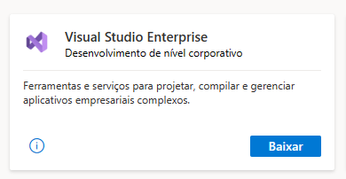

Vai abrir uma página onde mostra a versão que queremos baixar que mostra a chave de produto para podermos liberar o software para ser completo.

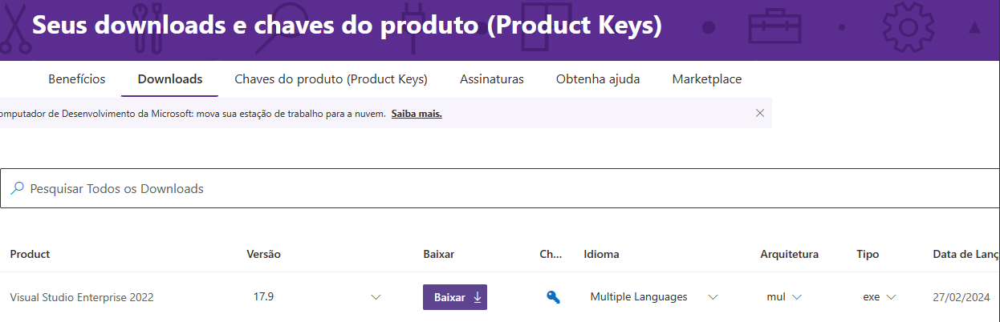

Após baixar o __.exe__ clique nele para começar a instalação, a primeira tela vai dizer sobre privacidade:

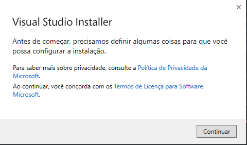

Depois ele vai instalar o __installer__ do Visual Studio, que é um software para baixar pacotes e atualizar nosso Visual Studio, ele é separado do programa oficial.

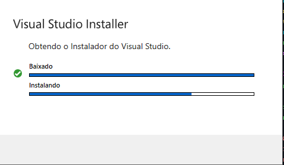

Após baixar o instalador, ele vai mostrar vários pacotes para baixar junto com a instalação do Visual Studio, onde vai mostrar a seguinte tela:

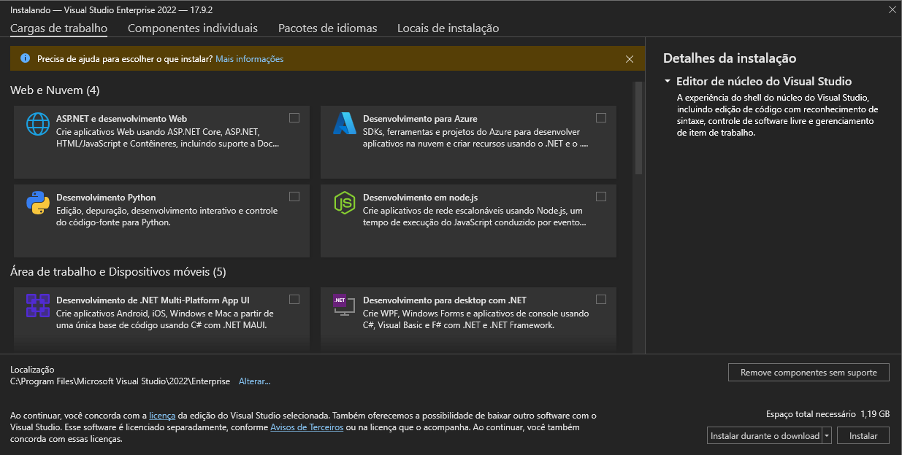

Devemos escolher os seguintes pacotes para instalar junto:

1. Para instalar tudo que precisamos do ASP.NET Core para criar nossas APIs.

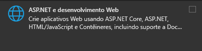

2. Para criar aplicativos de celular.

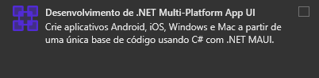

3. Para criar programas Desktop para computador.

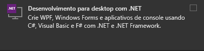

4. Para criar programas que sejam tipo cloud com Azure.

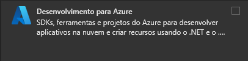

5. Criar ferramentas para auxiliar nos sistemas Windows.

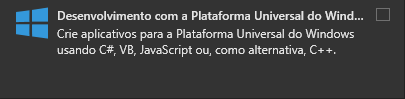

Selecione esses programas para instalar junto com o Visual Studio Enterprise.

Vai nos mostrar bem embaixo o espaço em disco necessário e vai mostrar a opção de ir instalando esses pacotes enquanto está baixando a IDE.

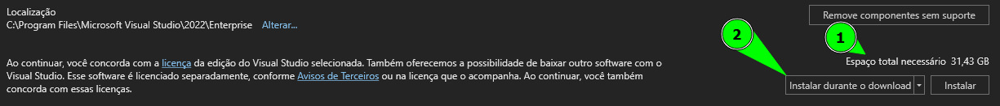

Agora é só esperar terminar a instalação, onde ele vai mostrar uma tela com o status.

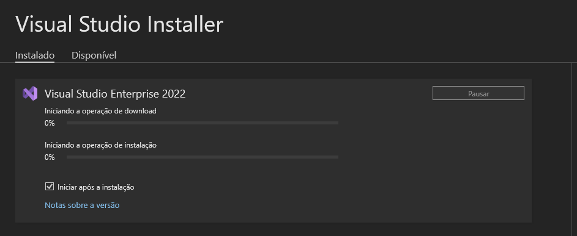

