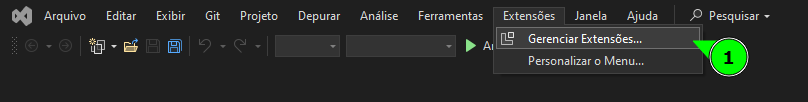

[Home](README.md)

## Adicionando temas e plugins no Visual Studio

---

Podemos adicionar programas e temas em nosso Visual Studio para deixarmos como quisermos.

Quando aberto o Visual Studio, nas opções bem acima selecione a opção __Extensões__ e clique em __Gerênciar Extensões__

Ele vai abrir uma tela mostrando programas que podem ser baixados para serem utilizados internamente no Visual Studio.

Busque na área de pesquisa por `Themes` e selecione um tema que te agrade no Visual Studio, quando clicar em __Baixar__ ele vai mostrar um aviso que quando for fechado o Visual Studio e aberto de novo vai ter instalado o programa.

Pode escolher quantos programas forem, no momento que fechar tudo e reabrir o Visual Studio vai ter instalados todos os programas selecionados.

Alguns podem ser precisos configurar ou pagar, mas cada programa tem suas configurações.

Assim que fechar o Visual Studio, vai abrir uma tela mostrando os programas que foram selecionados para serem baixados:

Clique em __Modify__ para ser instalado os pacotes no computador e configurados no Visual Studio.

