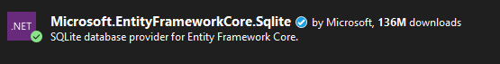
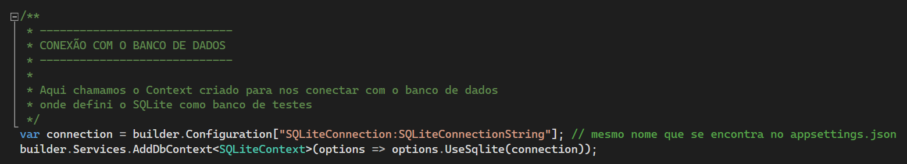

[Home](README)

# $$\color{lightgreen}\mathbb{Context}$$

---

### O que é Context

Uma classe `Context` é uma referência à classe `DbContext` do Entity Framework no .NET. 

`DbContext` é uma classe importante que encapsula as funcionalidades do Entity Framework, incluindo a capacidade de consultar e salvar instâncias de suas entidades.

O que a classe `DbContext` faz:

1. **Gerenciamento de Conexão**: Por padrão, o `DbContext` gerencia conexões com o banco de dados. Ele abre e fecha conexões conforme necessário. Por exemplo, o `DbContext` abre a conexão para executar uma consulta e, em seguida, fecha a conexão quando todos os conjuntos de resultados tiverem sido processados.

2. **Representação do Modelo de Dados**: A classe `DbContext` representa uma sessão com o banco de dados, permitindo que você consulte e salve instâncias de suas entidades. É uma ponte entre o seu domínio ou modelo de entidade e o banco de dados.

3. **Rastreamento de Alterações**: O `DbContext` rastreia todas as alterações feitas nas instâncias de suas entidades desde que foram carregadas no `DbContext`. Isso inclui novas entidades que você adicionou, entidades existentes que você modificou e entidades que você excluiu.

4. **Persistência de Alterações**: Quando o método `SaveChanges` é chamado, o `DbContext` gera comandos SQL para persistir essas alterações no banco de dados.

### O que é Entity Framework Core

O __Entity Framework Core__ (EF Core) é uma versão leve, extensível e de código aberto do Entity Framework, que é uma tecnologia de acesso a dados popular no .NET.

O EF Core é um _mapeador objeto-relacional (ORM)_ que permite aos desenvolvedores .NET trabalhar com bancos de dados usando objetos .NET. Ele elimina a necessidade da maior parte do código de acesso a dados que os desenvolvedores geralmente precisam escrever.

Com o EF Core, você pode realizar as seguintes tarefas:

- Modelar um domínio orientado a objetos no .NET e mapeá-lo para um banco de dados relacional.
- Consultar e manipular dados diretamente do código de aplicativo usando LINQ.
- Realizar o rastreamento de alterações, persistência e manipulação de dados de maneira eficiente.
- Migrar seu esquema de banco de dados de maneira segura usando migrações do EF Core.

O EF Core suporta muitos provedores de banco de dados, como SQL Server, SQLite, PostgreSQL, MySQL e muitos outros. Ele também suporta uma variedade de padrões de desenvolvimento de aplicativos, incluindo aplicativos de console, aplicativos de desktop, aplicativos da web ASP.NET Core e muito mais.

### Adicionando o EF Core no .NET

Dependências (ou Dependencies) são softwares criados na biblioteca do Nuget para podermos utilizar em projetos .NET, __Nuget__ é o gerenciador de pacotes do .NET que nos ajuda de uma maneira fácil de adicionar, remover e atualizar bibliotecas e ferramentas em projetos .NET.
Todas as bibliotecas e ferramentas adicionadas ficam dentro de _Dependencies_ no nosso projeto, para poder adicionar nesse diretório devemos clicar com o botão direito do mouse no nome do diretório _Dependencies_ e escolher a opção __Manage Nuget Packages__ 


Ele vai abrir uma página visual do Nuget para pesquisarmos o pacote que queremos instalar no nosso projeto, de forma simples e fácil.


Devemos escolher o tipo de Entity Framework que queremos usar pelo tipo de banco de dados, no nosso caso queremos o __Microsoft.EntityFrameworkCore.Sqlite__ para gerenciar o banco SQLite, para instalar o banco acesse [esta documentação](../Configuration/SQLite-Install.md) e para configurar acesse [esta documentação](../Configuration/SQLite-Use.md).


Então clique em __Install__ e aceite os requisitos para o pacote e ele vai instalar para você nas dependências do projeto.
Assim que tiver baixado ele vai mostrar um check em verde no lado do pacote.



Após instalado podemos verificar se ele foi corretamente adicionado clicando duas vezes no nome da API na área de __Solution Explorer__


Devemos adicionar também o Pacote _Microsoft.EntityFrameworkCore.Tools_ junto com esse primeiro.


### Criando uma classe Context

Agora que instalamos o pacote no projeto, vamos criar sua configuração no nosso projeto, onde iremos criar uma pasta dentro de _Models_ chamada __Context__ onde ficam armazenado as conexões com o banco de dados.

No nosso caso que estamos trabalhando com SQLite, vamos criar uma classe dentro do diretório __Context__ chamado __SQLiteContext__ .

Criação do Folder __Context__.


Criação da classe __SQLiteContext__


Nessa nova classe, temos que estender a classe do Entity Framework chamada __DbContext__ em nossa classe de conexão ao banco de dados e depois adicionar o _Entity Framework Core_ em nossa lista de pacotes conectados nessa classe.

```csharp
// Antes
namespace RESTTemplate.Model.Context
{
    public class SQLiteContext
    {
    }
}

// Depois
using Microsoft.EntityFrameworkCore;

namespace RESTTemplate.Model.Context
{
    public class SQLiteContext : DbContext
    {
    }
}
```

Agora vamos construir dois construtores para nossa classe, um deles é vazio e o outro recebe por parâmetro opções de acesso.

```csharp
using Microsoft.EntityFrameworkCore;

namespace RESTTemplate.Model.Context
{
    public class SQLiteContext : DbContext
    {
        public SQLiteContext() 
        { 
            
        }

        public SQLiteContext(DbContextOptions<SQLiteContext> options) : base(options)
        {

        }
    }
}
```

Qualquer Context deve ter essa estrutura básica, agora vamos construir os métodos dos modelos que queremos em nosso banco de dados.

### Criando método de acesso ao Model Person

---

Agora vamos colocar em nossa classe Context a conexão ao Model de Person, para isso adicionamos o seguinte atributo:

```csharp
public DbSet<Person> Persons { get; set; }
```

### Atualizando o appsettings.json


Agora que criamos o nosso Context para acessar ao Banco de dados, devemos atualizar o arquivo _appsettings.json_ com os dados de conexão.

No nosso caso passamos uma String com o nome do nosso banco de dados utilizando na string o nome __Data Source__.

Deve ser colocado todo o caminho até o banco de dados, onde no nosso caso quando criamos localmente [nesta documentação](../Configuration/SQLite-Use) ele se encontra no seguinte caminho: _C:\sqlite\db\restemplate.db_ e no _appsettings.json_ sempre que tiver uma barra deve colocar duas, como mostra o exemplo abaixo:

```json
"SQLiteConnection": {
  "SQLiteConnectionString": "Data Source=C:\\sqlite\\db\\restemplate.db"  
}
```

 Podemos colocar essa info antes do _Logging_ no _appsettings.json_


### Conectando o banco de dados no Program.cs

Em .NET 8 é feito essa configuração no _Program.cs_ onde vamos dizer a nossa API qual é a conexão do nosso banco de dados, onde colocamos essas informações depois de _AddControllers()_.
Primeiro criamos uma variável puxando as informações que se encontram no _appsetings.json_ como configuramos:

```csharp
var connection = builder.Configuration["SQLiteConnection:SQLiteConnectionString"];
```

Depois criamos um serviço chamado __AddDbContext<>()__ onde iremos conectar o Context que criamos nos passos anteriores e definimos as opções de acesso. 

```csharp
builder.Services.AddDbContext<SQLiteContext>(options => options.UseSqlite(connection));
```

O código deve ficar mais ou menos assim:



Pronto! com isso temos a nossa conexão com o banco de dados definido em nosso projeto, agora podemos desenvolver os métodos de como se conectar em nosso caso no banco de dados SQLite.

