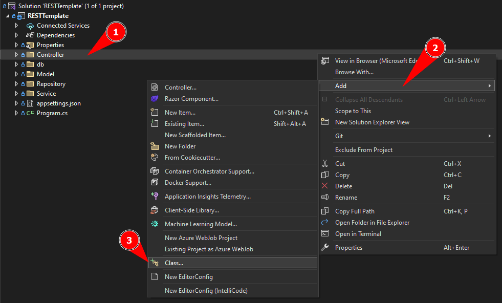

[Home](README.md)

# $$\color{lightgreen}\mathbb{Controller}$$
* [Construindo um Controller](Controller.md#construindo-um-controller)
	* [Estrutura da Classe](Controller.md#estrutura-da-classe)
	* [Configurando o Service](Controller.md#configurando-o-service)
	* [Configurando as rotas HTTP](Controller.md#configurando-as-rotas-http)
		* [HttpGet](Controller.md#httpget)
		* [HttpPost](Controller.md#httppost)
		* [HttpPut](Controller.md#httpput)
		* [HttpDelete](Controller.md#httpdelete)
	* [Alterando o launchsettings.json](Controller.md#alterando-o-launchsettings.json)

---

## Construindo um Controller

Em uma API REST, um **Controller** é uma classe responsável por receber todas as requisições do usuário. Ele é a porta de entrada da API. Seus métodos, chamados **actions**, são responsáveis por uma página, controlando qual model usar e qual view será mostrado ao usuário.

A única pasta que vem por padrão com o template do ASP.NET, normalmente ele vem com um arquivo de exemplo, mas iremos construir um novo arquivo.

Deve ser criado um Controller para cada objeto que deve existir na nossa API, onde funciona da seguinte forma.

### Estrutura da Classe
---

Uma classe Controller possui uma estrutura base quase igual para todos, onde criamos uma classe clicando com o botão direito no folder __Controller__ depois escolher a opção __Add__ e depois __Class...__ 



Agora vamos chamar nossa classe de __PersonController__ e colocaremos as configurações necessárias para dizer que é uma classe Controller.


O Código inicial de uma classe não tem nada para ser definido como um Controller. por isso devemos invocar todas as partes que definem que é um Controller ASP.NET.

```csharp
// Classe Inicial
namespace RESTTemplate.Controller
{
    public class PersonController
    {
    }
}
```

Vamos adicionar as seguinte anotações em nossa classe:

$\color{orange}{\sf [ApiController]}$ = é um atributo do ASP.NET Core que, quando associado a um Controller ajuda a simplificar a codificação e a manter o código mais limpo.

Este atributo indica que um tipo e todos os tipos derivados são usados para server a response de HTTP.

ApiController auxilia o ControllerBase a fazer requisições Web com os métodos implementados no ControllerBase.

$\color{orange}{\sf [Route]}$ = É um atributo do ASP.NET Core que é usado para definir rotas para métodos de ação de um Controller. 

Ele descreve como os caminhos da URL são correspondidos ás ações e é usado para gerar URLs para links. 

O padrão é chamar todas as rotas definidas em cada método de ação ou criar uma rota geral, esse normalmente é o exemplo gerado automático:

```csharp
[Route("[controller]")]
```


$\color{orange}{\sf ControllerBase}$ = É uma classe base do ASP.NET Core que manipula solicitações HTTP, fornecendo um conjunto de propriedades e métodos comuns que Controllers podem usar para manipular solicitações HTTP e gerar respostas HTTP.

Um exemplo de método que o ControllerBase possui que utilizamos muito é o **Ok(object? value)** e **BadRequest(object? value)**

Com essas estruturas definimos que nossa Classe é do tipo Controller do ASP.NET, nosso código fica assim:

```csharp
using Microsoft.AspNetCore.Mvc;

namespace RESTTemplate.Controllers
{
    [ApiController]
    [Route("api/[controller]")]
    public class PersonController : ControllerBase
    {
	    // Código aqui
    }
}
```

Com isso podemos utilizar anotações do _AspNetCore_ para controlarmos as informações que entram e saem da nossa API.

Definimos encima que quando é usado $\color{orange}{\sf api/[controller]}$ estamos dizendo que nossa rota começa com _api_ e pega o nome do nosso Controller, que nesse exemplo é _Person_.

### Configurando o Service
---
Agora que temos o nossa interface [Service](Service.md) configurado e construído podemos chamar ele em nosso Controller, é o Service que vai lidar com as rotas utilizadas pelos clientes.

Para isso devemos construir um contrutor para a nossa Classe que espera receber esse Service e invocamos esse Service no Controller:

```csharp
namespace RESTTemplate.Controllers
{
    [ApiController]
    [Route("api/[controller]")]
    public class PersonController : ControllerBase
    {
	    private readonly ILogger<PersonController> _logger;
	    private IPersonService _personService;

		public PersonController(ILogger<PersonController> logger, IPersonService personService)
		{
			_logger = logger;
		    _personService = personService;
		}
    }
}
```

O nome com underline no inicio é um padrão do .NET para não ter que chamar o `this` e para usar como uso global, segue o exemplo do clean code.

injetando uma dependência de `ILogger<CalculatorController>`. A injeção de dependência é um padrão de design que permite que uma classe receba as dependências de outras classes.

`ILogger` é uma interface no .NET que permite registrar informações sobre a execução, erros e avisos dos sistemas de forma simples e fácil. É uma API ou biblioteca presente no .NET, do qual podemos utilizar para "escrever" alguma mensagem durante a execução do nosso código.

Esse construtor cria uma variável de somente leitura do `ILogger` para recebermos informações do projeto em tempo de execução.

### Configurando as rotas HTTP
---

Para construirmos as rotas que serão utilizadas por nossa API devemos definir a anotação do ASP.NET Core MVC que queremos que o método utilize e definimos o que ele vai retornar para o usuário, onde vamos mostrar um a um.

#### HttpGet
---

Possuímos duas rotas para o GET, uma é do ID e a outra é de todos os dados, temos como exemplo os dois métodos:

```csharp
/*
 * -------------------------
 * HTTP GET (READ) ALL DATA
 * -------------------------
*/

[HttpGet]
public IActionResult Get()
{
    return Ok(_personService.FindAll());
}

/*
 * ---------------------
 * HTTP GET (READ) BY ID
 * ---------------------
*/
[HttpGet("{id}")]
public IActionResult Get(long id)
{
    var person = _personService.FindbyID(id);
    if (person == null) return NotFound(); 
    return Ok(person);
}
```

- No primeiro método iremos retornar $\color{lightgreen}{\sf 200 \space OK}$ e entregando na Response do Postman todos os registros criados, sendo chamados pelo Service no método $\color{lightblue}{\sf FindAll()}$ que irá interagir com o banco de dados e trazer os objetos.
- No segundo método temos uma rota diferente do HttpGet inicial, onde ele recebe um valor pela requisição definidos por `{}` na rota (no caso ele vai receber um ID). 
- É utilizado o método do Service chamado $\color{lightblue}{\sf FindbyId(id)}$ que busca no banco de dados um registro pelo ID definido. Caso ele não encontre o Registro retorna para o response $\color{red}{\sf 404 \space NOT \space FOUND}$ e caso encontre o registro ele retorna $\color{lightgreen}{\sf 200 \space OK}$ junto com o objeto encontrado no response do Postman.
- $\color{yellow}{\sf IActionResult}$ é uma interface no ASP.NET Core que especifica como o servidor deve responder à solicitação, como escrever dados na resposta ou retornar um código de status de erro. O tipo de retorno `IActionResult` é apropriado quando vários tipos de retorno `ActionResult` são possíveis em uma ação. Os tipos `ActionResult` representam vários códigos de status HTTP.

Qualquer classe não abstrata derivada de `ActionResult` se qualifica como um tipo de retorno válido. Alguns tipos de retorno comuns nesta categoria são `BadRequestResult` (400), `NotFoundResult` (404) e `OkObjectResult` (200).

#### HttpPost
---

Para o POST (Create) temos o seguinte código de exemplo:

```csharp
/*
 * -------------------
 * HTTP POST (CREATE)
 * -------------------
*/

[HttpPost]
public IActionResult Post([FromBody] Person person)
{
    if (person == null) return BadRequest();
    return Ok(_personService.Create(person));
}
```

- Neste exemplo temos que o nosso método possui o $\color{yellow}{[FromBody]}$  que significa que ele vai pegar o Body da requisição e transformar no objeto Person definido, então tudo que colocarmos no Postman na aba **Body** ele vai transformar em nossa API em um objeto Person. 
- Caso o Body esteja vazio, ele vai retornar $\color{red}{\sf 400 \space BAD \space REQUEST}$, caso tenha um valor, ele vai utilizar o método do Service $\color{lightblue}{\sf Create(Person \space person)}$ para criar o objeto Person no nosso banco de dados e retornar ele no nosso Response do Postman.

#### HttpPut
---

O PUT (Update) é a mesma estrutura do POST, a única coisa que muda é que iremos usar o método $\color{lightblue}{\sf Update(Person \space person)}$ para atualizarmos no banco de dados nosso objeto passado.

```csharp
/*
 * ------------------
 * HTTP PUT (UPDATE)
 * ------------------
*/

[HttpPut]
public IActionResult Put([FromBody] Person person)
{
    if (person == null) return BadRequest();
    return Ok(_personService.Update(person));
}
```

#### HttpDelete
---
O DELETE serve para chamarmos o método do Service $\color{lightblue}{\sf Delete(id)}$ para remover o dado do banco de dados e não retorna nada para o response

```csharp
/*
 * ---------------------
 * HTTP DELETE (DELETE)
 * ---------------------
*/

[HttpDelete("{id}")]
public IActionResult Delete(long id)
{
   _personService.Delete(id);
    return NoContent();
}
```

É bem simples, ele remove o dado e entrega o resultado $\color{lightgreen}{\sf 204 \space NO \space CONTENT}$.

### Alterando o launchSettings.json
---
Após configurado os métodos, devemos alterar o arquivo gerado pelo template ASP.NET chamado _launchSettings.json_ para iniciar o nosso projeto em uma rota específica.

temos 3 formas de iniciar o nosso projeto, modo __http__ para rota http no localhost, __https__ para rota https no localhost e modo __IIS Express__ é uma versão leve e independente do IIS otimizada para desenvolvedores. Ele é usado para desenvolver e testar sites.

Então nossa principal mudança nesse documento é colocar a URL que será ativada na hora que o programa rodar, assim facilitando ao sistema de já iniciar em um ponto específico.


Dessa forma toda vez que for iniciado o projeto, ele vai rodar a URL com a rota GET ALL pegando todos os dados salvos em banco.


