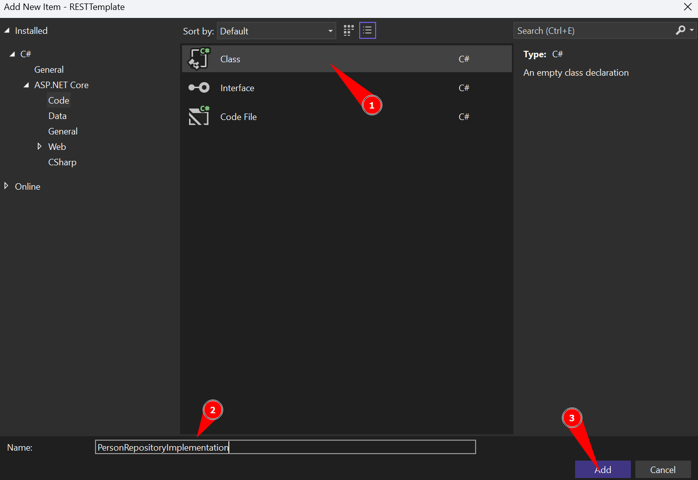

[Home](README.md)

# $$\color{lightgreen}\mathbb{Implementation}$$

- [Implementation do Repository](Implementation.md#implementation-do-repository)
	- [Método Create](Implementation.md#método-create)
	- [Método FindbyId e FindAll](Implementation.md#método-findbyid-e-findall)
	- [Método Update](Implementation.md#método-update)
	- [Método Delete](Implementation#método-delete)
- [Implementation do Service](Implementation.md#implementation-do-service)
	- [Método Create do Service](Implementation.md#método-create-do-service)
	- [Método Update do Service](Implementation.md#método-update-do-service)
	- [Método Delete do Service](Implementation.md#método-delete-do-service)
	- [Método FindAll do Service](Implementation.md#método-findall-do-service)
	- [Método FindbyId do Service](Implementation.md#método-findbyid-do-service)
* [Configurando o Repository e o Service](Implementation.md#configurando-o-repository-e-o-service)

---

Agora que temos o [Context](Context.md) definido com as regras de conexão ao banco de dados, devemos criar a implementação dos métodos que podemos utilizar no banco de dados.

Primeiro devemos criar o folder e as interfaces do [Repository](Repository.md) e [Service](Service.md)


### Implementation do Repository

Agora iremos construir a estrutura base dos métodos que iremos utilizar em nossos Controllers, utilizando o sistema do CRUD, que possui os seguinte items:

$\color{yellow}{\sf Create}$ = utilizamos a requisição HTTP $\color{orange}{\sf POST}$ para criar um objeto no banco de dados, mas na nossa Interface usamos o método $\color{lightblue}{\sf Create(Object \space object)}$ para criarmos um objeto novo no banco de dados.

$\color{yellow}{\sf Read}$ = utilizamos a requisição HTTP $\color{cyan}{\sf GET}$ para buscar um objeto no banco de dados, mas na nossa Interface usamos o método $\color{lightblue}{\sf FindById(long \space id)}$ para procurar por um objeto específico pelo seu ID ou  $\color{lightblue}{\sf FindAll()}$ para procurar por todos os objetos existentes no banco de dados.

$\color{yellow}{\sf Update}$ = utilizamos a requisição HTTP $\color{lightgreen}{\sf PUT}$ para editar um objeto no banco de dados, mas na nossa Interface usamos o método $\color{lightblue}{\sf Update(Object \space object)}$ para atualizarmos um objeto já existente no banco de dados.

$\color{yellow}{\sf Delete}$ = utilizamos a requisição HTTP $\color{red}{\sf DELETE}$ para criar um objeto no banco de dados, mas na nossa Interface usamos o método $\color{lightblue}{\sf Create(Object object)}$.

Devemos criar um folder chamado __Implementations__ dentro do folder __Repository__ onde iremos definir a lógica dos métodos definidos na interface do [Repository](Repository.md).


Colocamos o nome de __Implementations__


Como estamos criando um Repository do Objeto Person, o nome da nossa implementação deve começar com o nome do objeto, dizer que é de um Repository e dizer que é uma implementação.

| Nome do Model | Nome do Repository | Nome do Implementation         |
| ------------- | ------------------ | ------------------------------ |
| Person        | IPersonRepository  | PersonRepositoryImplementation |

Para isso iremos criar uma classe com esse nome da seguinte forma: iremos clicar com o botão direito encima do folder **Implementations** e depois no **Add...** e selecione a opção **Class...**


Definimos que é do tipo __Class__ e colocamos o nome __PersonRepositoryImplementation__ ou __PersonRepImp__ caso o nome fique muito grande.



Agora que temos nossa classe de implementação, devemos invocar dentro dela a interface que criamos para o nosso Repository, com a estrutura base dos métodos que vamos implementar.

```csharp
// Classe Recém criada
namespace RESTTemplate.Repository.Implementations
{
    public class PersonRepositoryImplementation
    {

    }
}

// Classe chamando a interface
namespace RESTTemplate.Repository.Implementations
{
    public class PersonRepositoryImplementation : IPersonRepository
    {

    }
}
```

Chamar a interface vai mostrar um erro no Visual Studio, porque não foram implementados os métodos construtores definidos na Interface dentro da classe, para isso o Visual Studio mostra como implementar essa funções mais rápido usando o `Quick Fix` como na imagem abaixo:


Agora devemos criar uma variável que invoca o [Context](Context.md) que criamos e construimos um construtor da nossa implementação que recebe um Context como parâmetro

```csharp
namespace RESTTemplate.Repository.Implementations
{
    public class PersonRepositoryImplementation : IPersonRepository
    {
		private SQLiteContext _context;

        public PersonRepositoryImplementation(SQLiteContext context) 
        { 
            _context = context; 
        }
    }
}
```

Com isso podemos chamar os métodos que criamos no nosso Context para acessarmos o banco de dados os dados referentes ao objeto Person.

#### Método Create
---
Aqui está a estrutura e a lógica do método Create do Repository:

```csharp
public Person Create(Person person)
{
    try
    {
        _context.Add(person);
        _context.SaveChanges();
    }
    catch (Exception)
    {
        throw;
    }
    return person;
}
```

O método Create vai pegar um objeto Person entrado como parâmetro e salvar no banco de dados, por isso devemos verificar se está entrando um objeto mesmo em nossa classe, para isso usamos a estrutura __TRY-CATCH__ que verifica se ocorre um erro na hora de tentar salvar em bando.

$\color{yellow}{\sf \_context.Add(person)}$ = Invoca o método definido no nosso Context para salvar no banco SQLite um objeto, mas esse método só prepara para salvar os dados no banco.

$\color{yellow}{\sf \_context.SaveChanges()}$ = Esse método salva nossas modificações pedida em banco, por isso podemos utilizar vários métodos e configurar o que quisermos e depois salvar no banco de dados.

Após salvar (caso não ocorra erros) ele vai retornar o objeto que foi salvo!

#### Método FindbyId e FindAll
---

Esses são os métodos de leitura de dados do banco de dados, normalmente são os métodos mais usados pelo sistema e pela API, então eles são divididos em duas partes, um método que traz todos os dados existentes (FindAll) e o método que busca somente um objeto procurando pelo ID passado pelo cliente (FindbyId).

A construção do método do FindbyId:

```csharp
public Person FindbyID(long id)
{
    return _context.Persons.SingleOrDefault(p => p.Id.Equals(id));
}
```

Aqui temos o método $\color{yellow}{\sf SingleOrDefault}$ junto com uma expressão Lambda que verifica se o ID que entrou é o mesmo que um ID que existe dentro do banco de dados, ele procura e avalia todos os IDs. Assim que encontra o Objeto desejado ele vai retornar esse objeto.

A construção do método do FindAll:

```csharp
public List<Person> FindAll()
{
    return _context.Persons.ToList();
}
```

Neste método ele pega do banco de dados todos os dados salvos no banco de dados e entrega em forma de lista.

#### Método Update
---

A estrutura do método update é o seguinte:

```csharp
public Person Update(Person person)
{
    if (!Exists(person.Id)) return null;

    var result = _context.Persons.SingleOrDefault(p => p.Id.Equals(person.Id));

    if (result != null)
    {
        try
        {
            _context.Entry(result).CurrentValues.SetValues(person);
            _context.SaveChanges();
        }
        catch (Exception)
        {
            throw;
        }
    }
    return person;
}
```

O primeiro __if__ serve para verificar se Existe o ID do objeto Person que foi passado como atributo, onde o método Exists foi definido também nesse Repository como:

```csharp
public bool Exists(long id)
{
    return _context.Persons.Any(p => p.Id.Equals(id));
}
```

Esse Método __Exists__ procura por qualquer objeto que possui o ID no banco, o método do Context chamado $\color{yellow}{\sf Any}$ diferente do $\color{yellow}{\sf SingleOrDefault}$ que busca um objeto, procura se existe um objeto com o ID e retorna `True` ou `False` após verificar todos os dados.

Após verificar se existe um objeto em banco, caso não tenha retorna nulo ao método, e faz a busca como o do Delete, onde procura o ID no banco e retorna o objeto encontrado a variável __result__.

Para fazer o update, devemos pegar o valor de entrada encontrada no banco usando o método $\color{yellow}{\sf Entry}$ do Context, definimos que ele é o valor atual que está no banco chamando o método $\color{yellow}{\sf CurrentValues}$ e depois definimos o valor com o objeto que entra como parâmetro utilizando o método $\color{yellow}{\sf SetValues}$.

#### Método Delete
---

Aqui está a estrutura base de um método de Delete:

```csharp
public void Delete(long id)
{
    var result = _context.Persons.SingleOrDefault(p => p.Id.Equals(id));

    if (result != null)
    {
        try
        {
            _context.Persons.Remove(result);
            _context.SaveChanges();
        }
        catch (Exception)
        {
            throw;
        }
    }
}
```

Esse método recebe como parâmetro o ID do objeto que queremos remover do banco de dados.

A variável __result__ utiliza o método $\color{yellow}{\sf SingleOrDefault}$ junto com uma expressão Lambda que verifica se o ID que entrou é o mesmo que um ID que existe dentro do banco de dados, ele procura e avalia todos os IDs.

Dentro do __TRY-CATCH__ tem um método chamado do Context que remove o resultado entregue na variável __result__ que deve ser um objeto Pessoa buscado pelo ID. Após removido ele não retorna nada.

### Implementation do Service
---
Devemos criar um folder chamado __Implementations__ dentro do folder __Service__ onde iremos definir a lógica dos métodos definidos na interface do [Service](Service.md).


Colocamos o nome de __Implementations__


Como estamos criando um Service do Objeto Person, o nome da nossa implementação deve começar com o nome do objeto, dizer que é de um Service e dizer que é uma implementação.

| Nome do Model | Nome do Service | Nome do Implementation      |
| ------------- | --------------- | --------------------------- |
| Person        | IPersonService  | PersonServiceImplementation |

Para isso iremos criar uma classe com esse nome da seguinte forma: iremos clicar com o botão direito encima do folder **Implementations** e depois no **Add...** e selecione a opção **Class...**


Definimos que é do tipo __Class__ e colocamos o nome __PersonServiceImplementation__ ou __PersonRepImp__ caso o nome fique muito grande.


Agora que temos nossa classe de implementação, devemos invocar dentro dela a interface que criamos para o nosso Service, com a estrutura base dos métodos que vamos implementar.

```csharp
// Classe Recém criada
namespace RESTTemplate.Service.Implementations
{
    public class PersonServiceImplementation
    {

    }
}

// Classe chamando a interface
namespace RESTTemplate.Service.Implementations
{
    public class PersonServiceImplementation : IPersonService
    {

    }
}
```

Chamar a interface vai mostrar um erro no Visual Studio, porque não foram implementados os métodos construtores definidos na Interface dentro da classe, para isso o Visual Studio mostra como implementar essa funções mais rápido usando o `Quick Fix` como na imagem abaixo:


Agora que vem a parte diferente do que o Repository, no Service nós buscamos os métodos criados no Repository, mas somente chamamos após fazer validações lógicas.

Vamos chamar no código não o Context, mas sim o Repository criado:

```csharp
namespace RESTTemplate.Service.Implementations
{
    public class PersonServiceImplementation : IPersonService
    {
		private readonly IPersonRepository _repository;
		public PersonServiceImplementation(IPersonRepository personRepository)
		{
		    _repository = personRepository;
		}
    }
}
```

$\color{yellow}{\sf \_repository}$ é a nossa invocação privada da interface Repository que criamos.

Agora todos os métodos de conexão com o banco de dados ficarão somente implementados na classe __PersonRepositoryImplementation__

#### Método Create do Service
---

O método é simples, chamamos somente o Create do Repository:

```csharp
public Person Create(Person person)
{
	return _repository.Create(person);
}
```

Porque criamos esse método? porque dai podemos fazer validações de negócio em nosso método:

```csharp
public Person Create(Person person)
{
	if (person.FirstName != null)
	{
		return _repository.Create(person);
	}
}
```

Como o nosso projeto é somente um template, os métodos ficam sem validações por enquanto.

#### Método Update do Service
---

```csharp
public Person Update(Person person)
{
   return _repository.Update(person);
}
```

#### Método Delete do Service
---

```csharp
public void Delete(long id)
{
    _repository.Delete(id);
}
```

#### Método FindAll do Service
---

```csharp
public List<Person> FindAll()
{
   return _repository.FindAll();
}
```

#### Método FindbyId do Service
---

```csharp
public Person FindbyID(long id)
{
    return _repository.FindbyID(id);
}
```

### Configurando o Repository e o Service
---

Agora que temos tanto o Repository quanto o service criados, devemos chamá-los no projeto.

Abrimos o arquivo __Program.cs__ onde iremos fazer uma coisa chamada $\color{magenta}{\sf Ingeção \space de \space dependência}$ no .NET.

Os passos são:

1) Abrimos o nosso arquivo **Program.cs**
2) Vamos até o método **ConfigureServices**
3)  Abaixo de _services.AddControllers();_ iremos adicionar as nossas Services
4) Para isso iremos usar o método _AddScoped<>_ passando como atributos primeiro o nosso Service com sua Interface e depois a nossa Implementation, como mostra abaixo:

```csharp
builder.Services.AddScoped<IPersonService, PersonServiceImplementation>();
```

 ```csharp
builder.Services.AddScoped<IPersonRepository, PersonRepositoryImplementation>();
```

O código completo com o Context fica:

```csharp
var connection = builder.Configuration["SQLiteConnection:SQLiteConnectionString"];
builder.Services.AddDbContext<SQLiteContext>(options => options.UseSqlite(connection));

builder.Services.AddScoped<IPersonService, PersonServiceImplementation>();
builder.Services.AddScoped<IPersonRepository, PersonRepositoryImplementation>();
```

Com isso concluimos as Implementations!