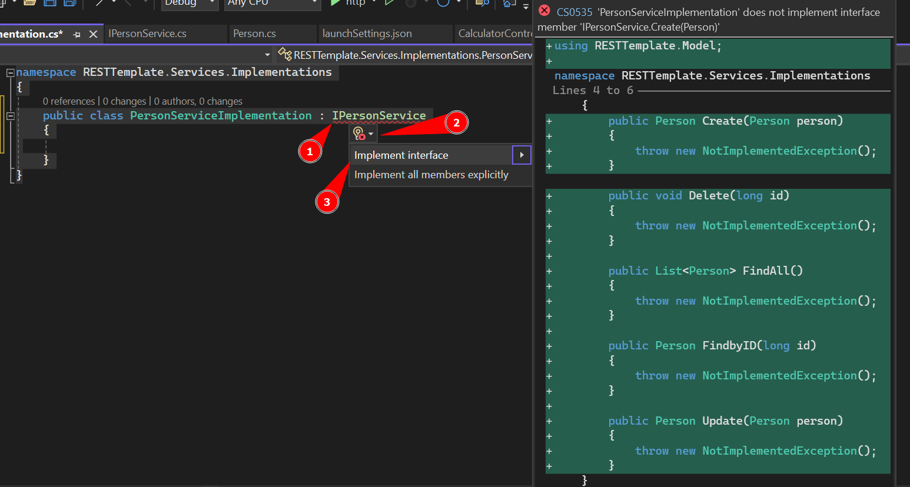

[Home](README.md)

# $$\color{lightgreen}\mathbb{Implementation}$$

---

Agora que temos o [Context](Context.md) definido com as regras de conexão ao banco de dados, devemos criar a implementação dos métodos que podemos utilizar no banco de dados.

Primeiro devemos criar o folder e as interfaces do [Repository](Repository.md) e [Service](Service.md)


### Implementation do Repository

Agora iremos construir a estrutura base dos métodos que iremos utilizar em nossos Controllers, utilizando o sistema do CRUD, que possui os seguinte items:

$\color{yellow}{\sf Create}$ = utilizamos a requisição HTTP $\color{orange}{\sf POST}$ para criar um objeto no banco de dados, mas na nossa Interface usamos o método $\color{lightblue}{\sf Create(Object \space object)}$ para criarmos um objeto novo no banco de dados.
$\color{yellow}{\sf Read}$ = utilizamos a requisição HTTP $\color{cyan}{\sf GET}$ para buscar um objeto no banco de dados, mas na nossa Interface usamos o método $\color{lightblue}{\sf FindById(long \space id)}$ para procurar por um objeto específico pelo seu ID ou  $\color{lightblue}{\sf FindAll()}$ para procurar por todos os objetos existentes no banco de dados.
$\color{yellow}{\sf Update}$ = utilizamos a requisição HTTP $\color{lightgreen}{\sf PUT}$ para editar um objeto no banco de dados, mas na nossa Interface usamos o método $\color{lightblue}{\sf Update(Object \space object)}$ para atualizarmos um objeto já existente no banco de dados.
$\color{yellow}{\sf Delete}$ = utilizamos a requisição HTTP $\color{red}{\sf DELETE}$ para criar um objeto no banco de dados, mas na nossa Interface usamos o método $\color{lightblue}{\sf Create(Object object)}$ .

Devemos criar um folder chamado __Implementations__ dentro do folder __Repository__ onde iremos definir a lógica dos métodos definidos na interface do [Repository](Repository.md).


Colocamos o nome de __Implementations__


Como estamos criando um Repository do Objeto Person, o nome da nossa implementação deve começar com o nome do objeto, dizer que é de um Repository e dizer que é uma implementação.

| Nome do Model | Nome do Service   | Nome do Implementation         |
| ------------- | ----------------- | ------------------------------ |
| Person        | IPersonRepository | PersonRepositoryImplementation |
Para isso iremos criar uma classe com esse nome da seguinte forma: iremos clicar com o botão direito encima do folder **Implementations** e depois no **Add...** e selecione a opção **Class...**


Definimos que é do tipo __Class__ e colocamos o nome __PersonRepositoryImplementation__ ou __PersonRepImp__ caso o nome fique muito grande.


Agora que temos nossa classe de implementação, devemos invocar dentro dela a interface que criamos para o nosso Repository, com a estrutura base dos métodos que vamos implementar.

```csharp
// Classe Recém criada
namespace RESTTemplate.Repository.Implementations
{
    public class PersonRepositoryImplementation
    {

    }
}

// Classe chamando a interface
namespace RESTTemplate.Repository.Implementations
{
    public class PersonRepositoryImplementation : IPersonRepository
    {

    }
}
```

Chamar a interface vai mostrar um erro no Visual Studio, porque não foram implementados os métodos construtores definidos na Interface dentro da classe, para isso o Visual Studio mostra como implementar essa funções mais rápido usando o `Quick Fix` como na imagem abaixo:



Agora devemos criar uma variável que invoca o [Context](Context.md) que criamos e construimos um construtor da nossa implementação que recebe um Context como parâmetro

```csharp
namespace RESTTemplate.Repository.Implementations
{
    public class PersonRepositoryImplementation : IPersonRepository
    {
		private SQLiteContext _context;

        public PersonRepositoryImplementation(SQLiteContext context) 
        { 
            _context = context; 
        }
    }
}
```

Com isso podemos chamar os métodos que criamos no nosso Context para acessarmos o banco de dados os dados referentes ao objeto Person.

#### Método Create
---
Aqui está a estrutura e a lógica do método Create do Repository:

```csharp
public Person Create(Person person)
{
    try
    {
        _context.Add(person);
        _context.SaveChanges();
    }
    catch (Exception)
    {
        throw;
    }
    return person;
}
```

O método Create vai pegar um objeto Person entrado como parâmetro e salvar no banco de dados, por isso devemos verificar se está entrando um objeto mesmo em nossa classe, para isso usamos a estrutura __TRY-CATCH__ que verifica se ocorre um erro na hora de tentar salvar em bando.

$\color{yellow}{\sf \_context.Add(person)}$ = Invoca o método definido no nosso Context para salvar no banco SQLite um objeto, mas esse método só prepara para salvar os dados no banco.

$\color{yellow}{\sf \_context.SaveChanges()}$ = Esse método salva nossas modificações pedida em banco, por isso podemos utilizar vários métodos e configurar o que quisermos e depois salvar no banco de dados.

Após salvar (caso não ocorra erros) ele vai retornar o objeto que foi salvo!

#### Método Delete
---

Aqui está a estrutura base de um método de Delete:

```csharp
public void Delete(long id)
{
    var result = _context.Persons.SingleOrDefault(p => p.Id.Equals(id));

    if (result != null)
    {
        try
        {
            _context.Persons.Remove(result);
            _context.SaveChanges();
        }
        catch (Exception)
        {
            throw;
        }
    }
}
```

Esse método recebe como parâmetro o ID do objeto que queremos remover do banco de dados.

A vari


