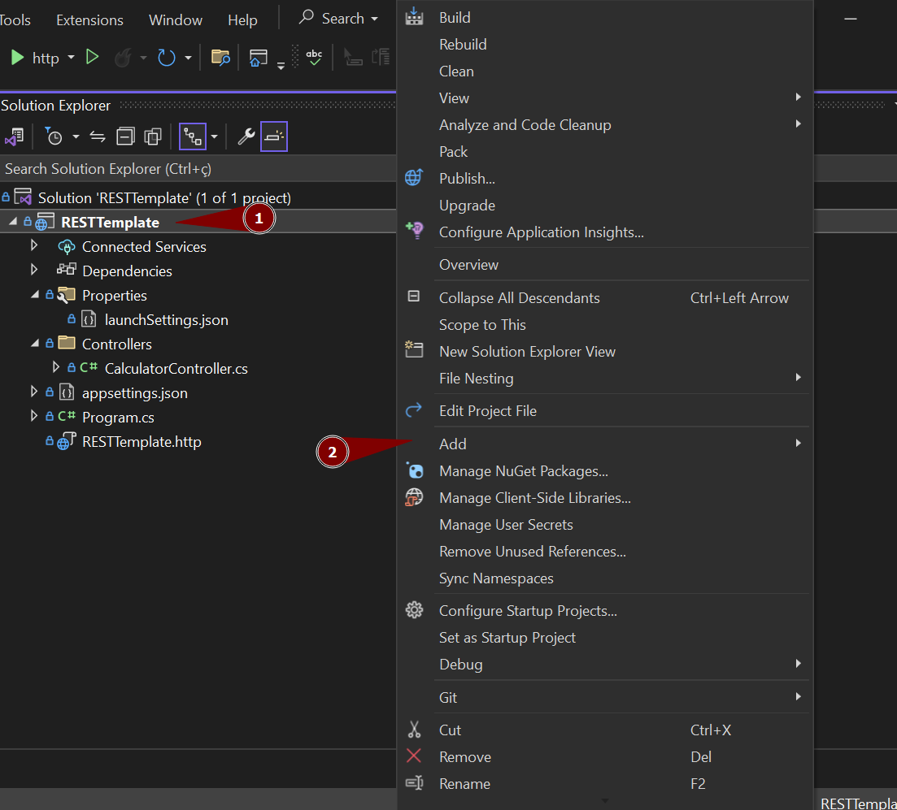
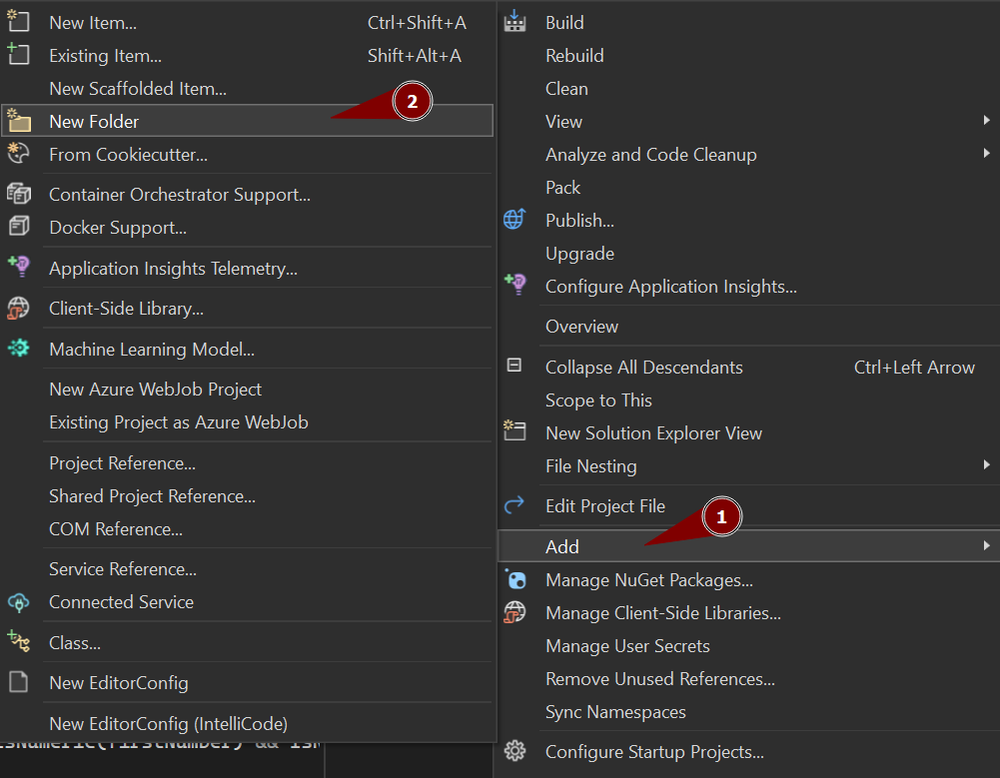
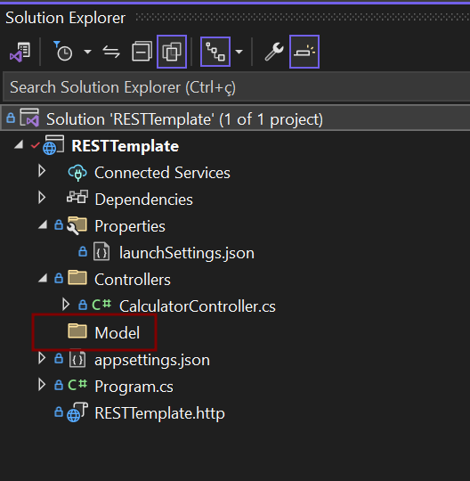
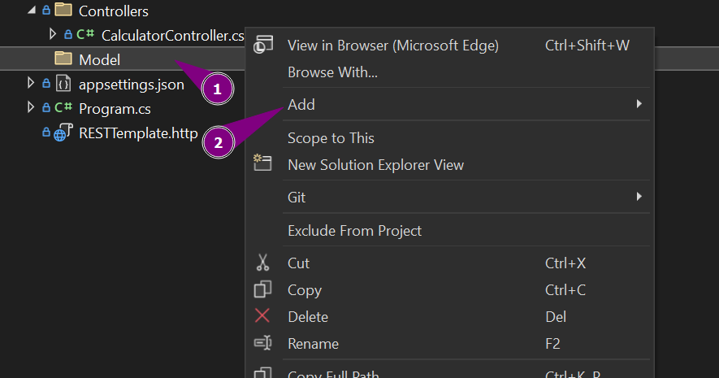
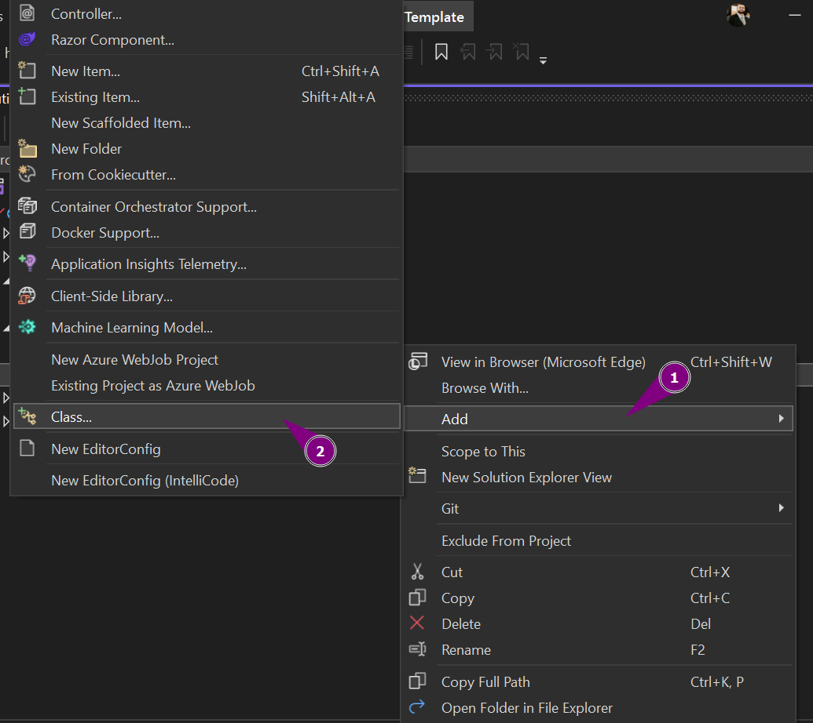
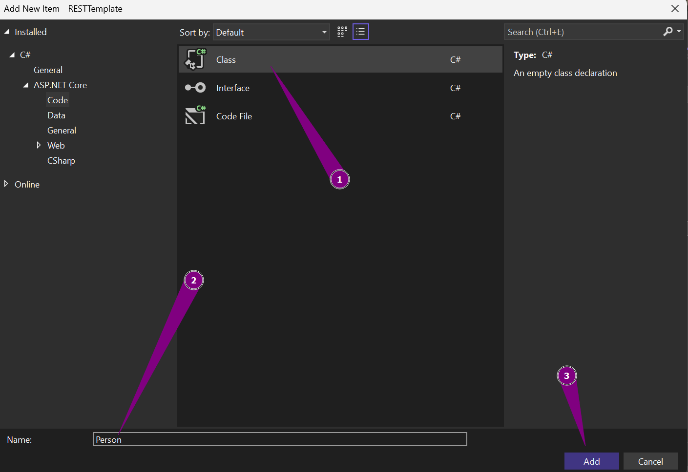
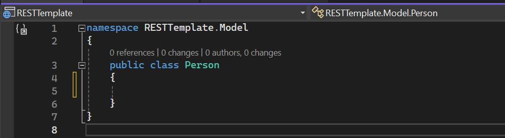
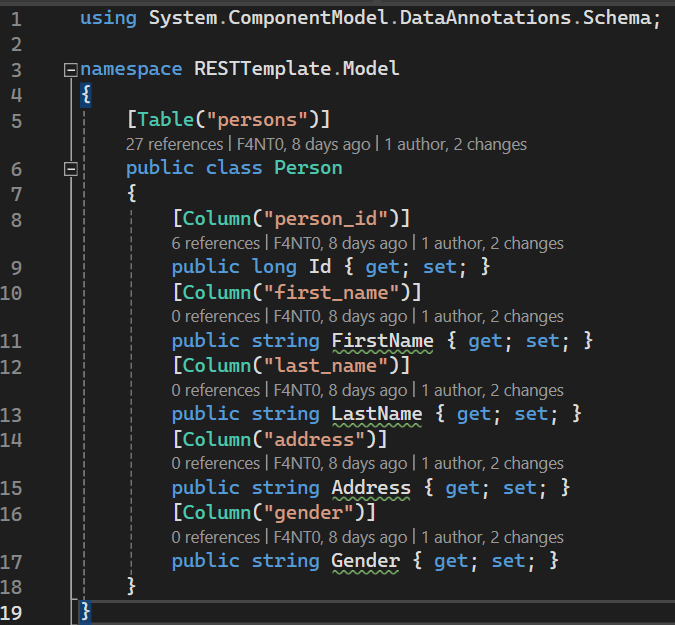

[Home](README.md)

# $$\color{lightgreen}\mathbb{Model}$$

---

### O que é um Model

Em uma API REST, o termo __Model__ geralmente se refere à estrutura de dados que é usada para representar os recursos que a API está expondo para os clientes.

Por exemplo, se você tem uma API de cadastros (como por exemplo esta), você pode ter um Model para representar uma pessoa, que inclui campos como _nome_, _sobrenome_, _endereço_, _gênero_, etc.

Esses Models são usados para estruturar os dados que são enviados e recebidos pela API. Eles ajudam a garantir que a API e os clientes que a utilizam estejam em sincronia em termos do formato dos dados.

Além disso, em muitos frameworks de desenvolvimento, o Model também pode se referir a uma parte do código que interage com o banco de dados para criar (_Create_), ler (_Read_), atualizar (_Update_) e deletar (_Delete_) registros, que nós desenvolvedores chamamos de __CRUD__ ($\color{orange}\sf C$reate , $\color{lightgreen}\sf R$ead , $\color{lightblue}\sf U$pdate, $\color{red}\sf D$elete ).

### Criando um folder Model

Primeiro devemos criar um folder novo no projeto chamado __Model__ porque ele não vem como padrão quando criamos um [projeto inicial](../Configuration/ASPNET-VSCreation.md) em ASP.NET.

Se seguiu o fluxo de documentos, esse folder foi criado na hora de criar uma classe [Context](Context.md#criando-uma-classe-context) mas se não seguiu abaixo mostra como criar:

1) Clique com botão direito encima do projeto no Visual Studio e clique na opção **Add..**



2) Depois selecione a opção **New Folder**.



3) Coloque o nome do folder de **Model**.



Ok, agora criamos o Folder vazio!

### Criando a classe Model

Cada objeto que devemos trabalhar tem que possuir sua própria classe Model, por isso criamos um folder para armazenar todos os Models que devemos criar, no nosso exemplo desse template é o objeto __Person__ que deve possuir _Nome_, _Sobrenome_, _Endereço_, _Gênero_.

Para criar a classe devemos fazer o seguinte:

1. Clique com o botão direito no Folder Model e selecione a opção **Add**



2. Depois selecione a opção **Class...** para abrir o criador de classes do Visual Studio



3. Coloque o nome desejado que será o nome oficial da classe, iremos chamar a nossa classe de **Person**.



### Estrutura base de uma classe

Quando criamos uma classe por um template, ele é gerado uma classe simples como na imagem abaixo:



Nesse código temos o seguinte:

```csharp
namespace RESTTemplate.Model
{
    public class Person
    {
    }
}
```

$\color{yellow}{\sf namespace}$ = namespace serve para organizar um conjunto de classes pelo seu folder definido, no nosso exemplo acima a nossa classe Person faz parte do folder Model da API RESTTemplate.

$\color{yellow}{\sf public}$ = public significa que nossa classe pode ser lidar e utilizada por todo o projeto, sem ser restrito a alguma lugar.

$\color{yellow}{\sf class}$ = class mostra que esse arquivo é uma classe que podemos definir métodos e objetos internos dela.

### Colocando objetos nessa classe
---
podemos colocar objetos e atributos dentro de uma classe Model, onde colocamos todos os dados necessários para o objeto trabalhado, sempre lembrando de colocar os nomes em inglês e sempre começando pelo __ID__ que serve para verificarmos qual é o objeto específico que estamos trabalhando.

No objeto __Person__ temos os seguintes dados que serão transformados em atributos em C# no nosso programa:

| Informação              | Atributo em C# |
| ----------------------- | -------------- |
| Identificador da pessoa | Id             |
| Nome da pessoa          | FirstName      |
| Sobrenome da pessoa     | LastName       |
| Endereço da pessoa      | Address        |
| Gênero da pessoa        | Gender         |

Lembre-se sempre que o inicio dos nomes de atributos em C# são com letra maíuscula e palavras internas também começa com maíusculas.

Tendo isso em mente, toda vez que criamos um atributo devemos dizer que tipo que ele é (int,string,long, etc...) e seu Getter e Setter para buscar o atributo externamente ou altera-lo, e também não esquecer de verificar se ele é público (pode ser acessado por outras classes) ou privado (usado somente dentro da classe onde foi criado).

Abaixo temos o exemplo de um ID:

```csharp
public long Id { get; set; }
```

O código com todos os atributos definidos dentro da sua classe:

```csharp
namespace RESTTemplate.Model
{
    public class Person
    {
        public long Id { get; set; }
        public string FirstName { get; set; }
        public string LastName { get; set; }
        public string Address { get; set; }
        public string Gender { get; set; }
    }
}
```

### Configurando o Model com o Context

Como pegamos essas informações do banco de dados, devemos ajustar nosso Model para conseguir receber as informações vindas do [Context](Context.md) que criamos para se conectar ao banco de dados do SQLite.

Os nomes que se encontram no banco de dados são diferentes aos nomes que se encontra na classe Model, por isso podemos fazer as modificações necessárias para que o Model reconheça esses valores.

A tabela do objeto __Person__ possui o seguinte código SQL:

```sql
CREATE TABLE IF NOT EXISTS persons (
	person_id INTEGER PRIMARY KEY,
	first_name TEXT NOT NULL,
	last_name TEXT NOT NULL,
	address TEXT,
	gender TEXT
);
```

A primeira coisa que devemos fazer é avisar ao nosso Model que a tabela que ele vai interagir no banco de dados é a tabela __persons__.

Existe no ASP.NET uma anotação para definir o nome de qual tabela estamos nos conectando, chamada de $\color{lightgreen}\sf Table$ que recebe como string o nome da tabela.

Essa anotação deve ser colocada antes da nossa classe, para que ele reconheça que a classe do __Person__ está vinculado a tabela __persons__.

```csharp
[Table("persons")]
public class Person {}
```

Agora que foi reconhecido qual tabela nosso objeto pertence, devemos dizer cada um dos atributos pertence a qual coluna da tabela, por isso usamos a anotação $\color{lightgreen}\sf Column$ para cada atributo, passando como string o nome que esse atributo se referencia na tabela, como abaixo:

| Atributo no Objeto | Coluna do banco |
| ------------------ | --------------- |
| Id                 | person_id       |
| FirstName          | first_name      |
| LastName           | last_name       |
| Address            | address         |
| Gender             | gender          |
O nosso código na classe fica da seguinte forma:

```csharp
[Column("person_id")]
public long Id { get; set; }

[Column("first_name")]
public string FirstName { get; set; }

[Column("last_name")]
public string LastName { get; set; }

[Column("address")]
public string Address { get; set; }

[Column("gender")]
public string Gender { get; set; }
```

Com isso agora o nosso Model pode receber dados do banco de dados e também enviar esses dados de uma forma bem simples.

O código completo com as importações necessárias ficou:


