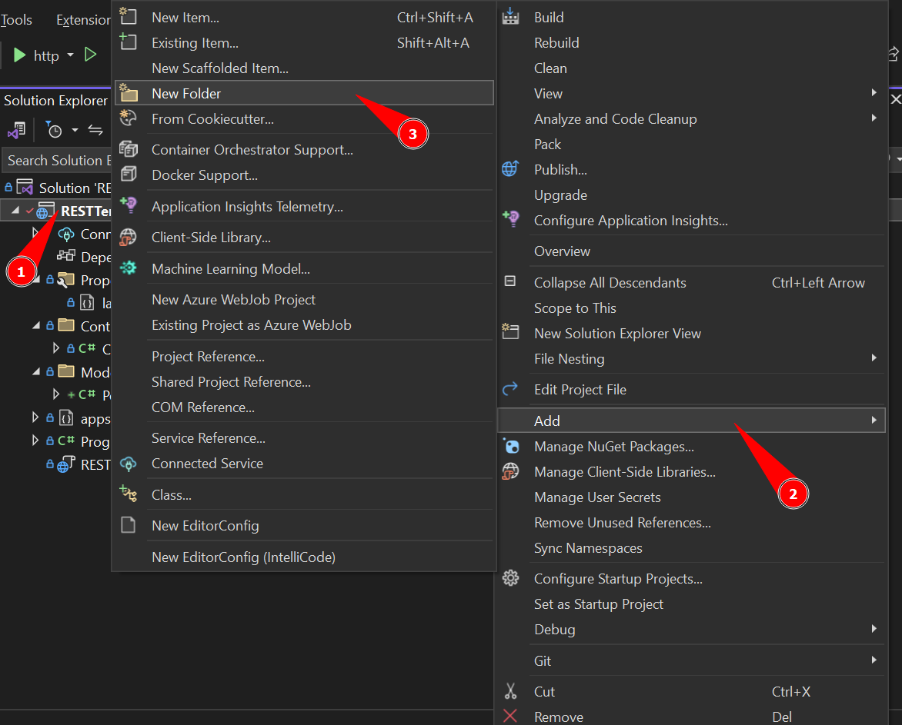
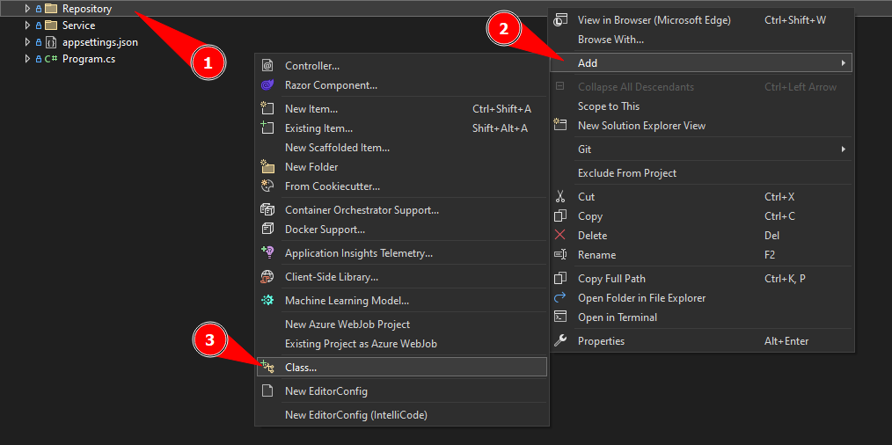

[Home](README.md)

# $$\color{lightgreen}\mathbb{Service}$$

---

Em uma API REST no C#, os __Services__ são componentes que encapsulam a lógica de negócios e as operações que podem ser reutilizadas. Eles são responsáveis por realizar tarefas específicas e complexas, como interagir com banco de dados a partir de lógicas bem definidas.

Os Services são usados para manter os __Controllers__ enxutos e organizar a lógica de negócio do projeto, ele recebe os métodos implementados no __Repository__ que vai se conectar ao banco e vai somente fazer isso depois de passar pela lógica definida, como por exemplo, somente criar um objeto caso tenha um ID criado, então essa lógica passa pelo Service antes de invocar o Repository para realmente interagir no banco de dados.

Isso tudo serve para manter o código enxuto e fácil de manter, criando camadas de verificação que ajudam o desenvolvedor a fazer manutenção.

### Criando um diretório Service

O folder Services não vem como padrão no ASP.NET, por isso devemos criar um novo folder e chamar ele de Services, para isso clicamos com o botão direito no nome do projeto, clicamos em **Add..** e depois **New Folder...**, após isso definimos o nome como **Service**.



### Criando a interface do Service

Uma interface em C# é um tipo que define um conjunto de métodos e propriedades que uma classe ou struct deve implementar. Ela define um contrato que a classe ou struct deve seguir.

Aqui estão alguns pontos importantes sobre as interfaces em C#:

- Uma interface pode conter declarações (assinaturas sem nenhuma implementação) dos seguintes membros: Métodos, Propriedades, Indexadores e Eventos.
- As interfaces não podem declarar dados de instância, como campos, propriedades implementadas automaticamente ou eventos semelhantes a propriedades.
- A partir do C# 11, uma interface pode declarar membros `static abstract` e `static virtual` para todos os tipos de membro, exceto campos.
- Uma interface não pode conter campos de instância, construtores de instância ou finalizadores.
- Os membros da interface são públicos por padrão.

Para criar uma interface é bem simples, clicamos com o botão direito no folder que queremos criar a interface e selecionamos **Add...** depois **Class...**



Em **Class...** selecionamos a opção **Interface** e colocamos o nome do nosso Model desejado começando com um I para dizer que é uma Interface e depois escrito Service para sabermos que é um Service da API, como no exemplo abaixo:

| Nome do Model | Nome do Service |
| ------------- | --------------- |
| Person        | IPersonService  |
 Essa interface terá a estrutura dos métodos utilizados para receber dados do banco de dados, passando por [Repository](Repository.md) para o Service.

Dai temos os seguintes construtores:

```csharp
// Create serve para criar novos objetos no banco
Person Create(Person person);

// FindbyId serve para buscar um dado pelo seu ID
Person FindbyId(long id);

// FindAll serve para trazer todos os dados salvos em banco
List<Person> FindAll();

// Update serve para atualizar um dado no banco de dados
Person Update(Person person);

// Delete serve para remover um dado do banco de dados
void Delete(long id);
```

Toda interface tem a seguinte estrutura:

```csharp
namespace RESTTemplate.Services
{
    public interface IPersonService
    {
    }
}
```

$\color{yellow}{\sf namespace}$ = namespace serve para organizar um conjunto de classes pelo seu folder definido, no nosso exemplo acima a nossa classe IPersonService faz parte do folder Services da API RESTTemplate.

$\color{yellow}{\sf public}$ = public significa que nossa classe pode ser lidar e utilizada por todo o projeto, sem ser restrito a alguma lugar.

$\color{yellow}{\sf interface}$ = interface mostra que o nosso arquivo é uma interface do C# que podemos escrever os métodos que iremos usar em Controllers. 

Com isso construimos a interface do nosso Service e vamos implementar ela como mostra no documento [Implementation](Implementation.md)