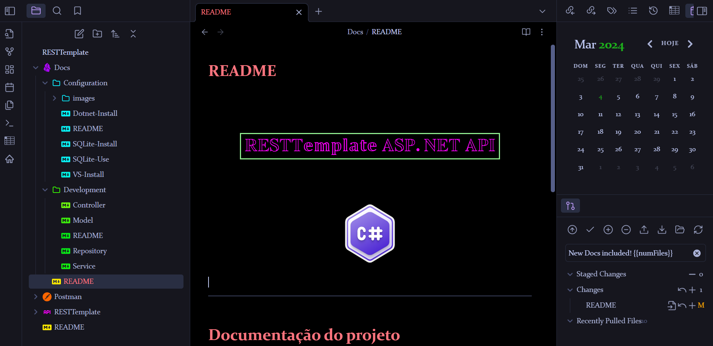

	

---

## O que é RESTTemplate

	

## Documentação do projeto

Documentação pelo Github: [RESTemplate Docs](Docs/README.md) 

	

Toda a documentação do projeto pode ser melhor visualizado no programa [Obsidian](https://obsidian.md/) que pode ser baixado [neste link](https://obsidian.md/download).

Quando baixar o programa Obsidian, abra um _vault_ novo com este repositório, ele já vai pegar todas as informações e plugins necessários para ler o projeto.

A página inicial da documentação é a mostrada abaixo:

